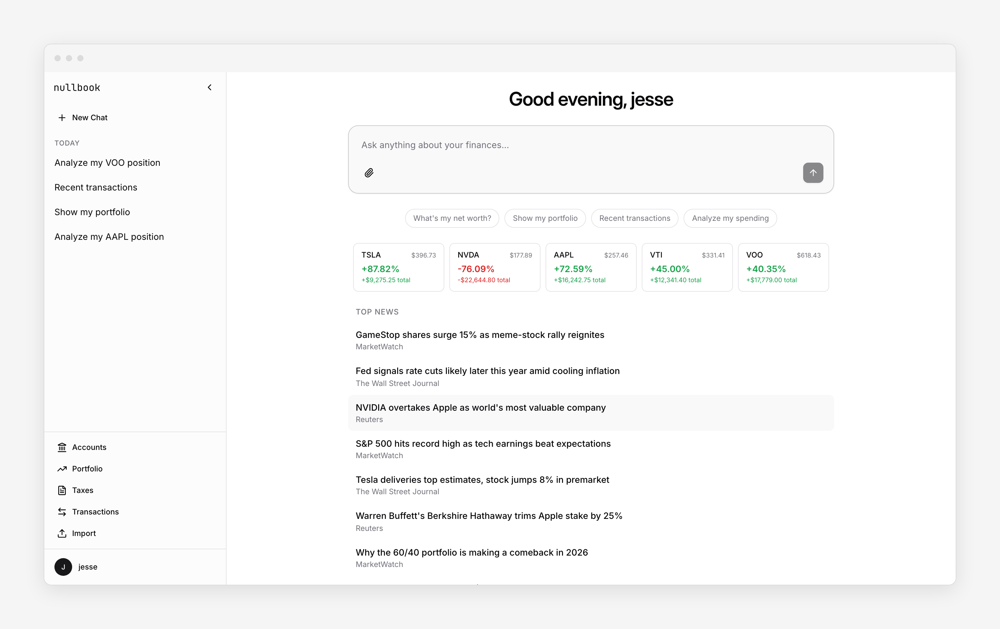

# nullbook

Open source personal finance with AI. Self-hosted, local-first, BYOK.

[nullbook.ai](https://nullbook.ai)



## Quick start

```bash
git clone https://github.com/jfornear/nullbook.git
cd nullbook
./setup.sh
make dev
```

Or with Docker: `cp .env.example .env && docker compose up`

Add an AI provider key to `.env` — Anthropic, OpenAI, or Ollama for fully local AI.

## Features

- AI chat agent for your finances
- Bank syncing via Plaid
- Auto-categorized transactions
- Portfolio tracking with real-time prices
- Budgets and goals
- Tax estimation and Schedule C
- Email receipt scanning
- CSV, OFX, QIF import

## Privacy

Everything runs on your machine. SQLite database, encrypted credentials, no telemetry.

## License

[MIT](LICENSE)
