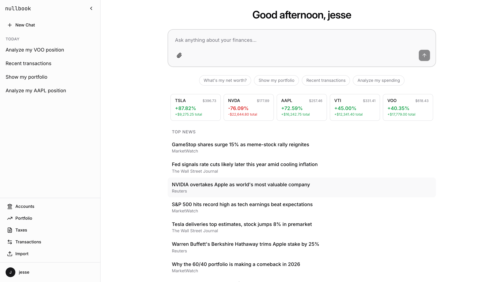
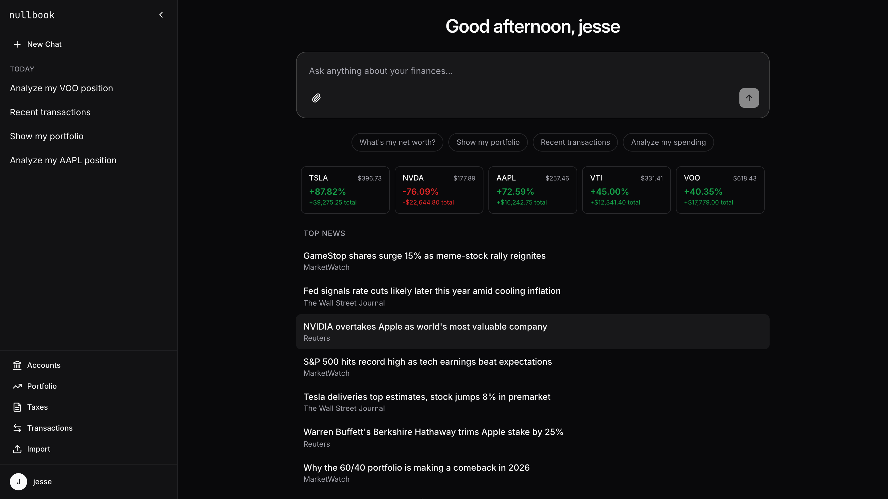
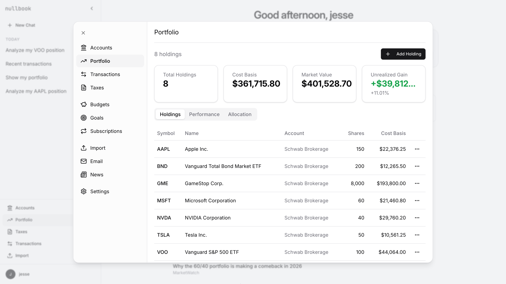
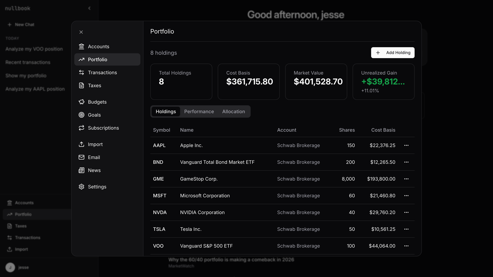
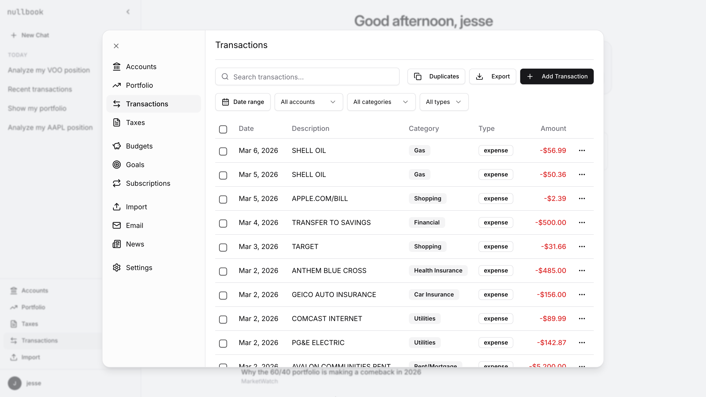
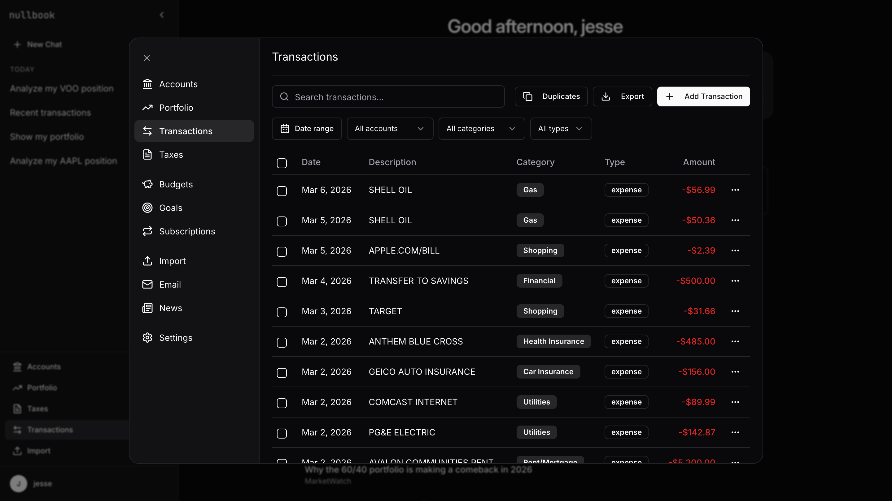
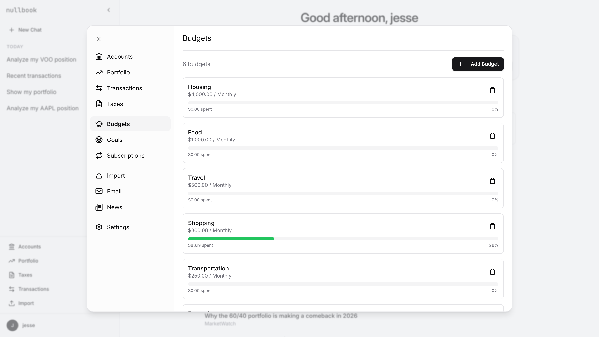
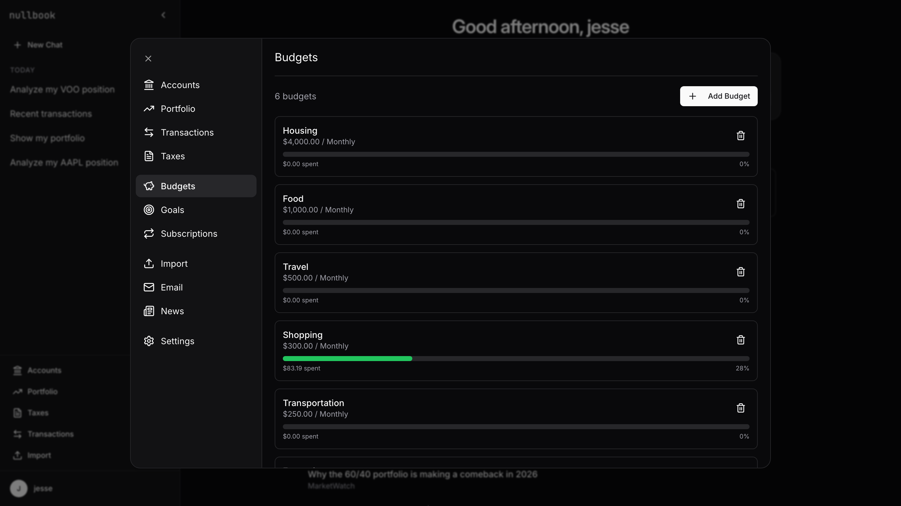

# nullbook

Open source personal finance with AI. Self-hosted, local-first, BYOK.

[nullbook.ai](https://nullbook.ai)

|                            Light                            |                         Dark                          |
| :---------------------------------------------------------: | :---------------------------------------------------: |
|                  |                  |
|        |        |
|  |  |
|            |            |

## Features

- Chat with an AI agent about your finances (Claude, OpenAI, or Ollama)
- Sync bank accounts via Plaid
- Auto-categorize transactions
- Scan email for receipts (IMAP)
- Track subscriptions and send cancellation emails
- Estimate taxes and generate Schedule C
- Track portfolio with real-time prices
- Import CSV, OFX, QIF files

## Quick start

```bash
git clone https://github.com/jfornear/nullbook.git
cd nullbook
./setup.sh    # creates .env, installs deps, runs migrations
make dev      # starts redis, backend (:8001), frontend (:5173)
```

Or with Docker:

```bash
cp .env.example .env
docker compose up
```

You need at least one AI provider key in `.env` — `ANTHROPIC_API_KEY`, `OPENAI_API_KEY`, or point `LLM_PROVIDER=ollama` at a local model.

## Integrations

All optional. If you don't configure one, that feature is just disabled.

| Integration                | Guide                                                        |
| -------------------------- | ------------------------------------------------------------ |
| Bank syncing (Plaid)       | [Setup](docs/integrations.md#bank-syncing-plaid)             |
| Gmail receipt scanning     | [Setup](docs/integrations.md#gmail-receipt-scanning)         |
| Cancellation emails (SMTP) | [Setup](docs/integrations.md#cancellation-emails-smtp)       |
| AI provider                | [Anthropic, OpenAI, or Ollama](docs/integrations.md#ai-chat) |

## Privacy

Everything runs on your machine. SQLite database, encrypted credentials, no telemetry. The only external calls are to your configured AI provider, Plaid (if you connect a bank), and Yahoo Finance (for stock prices). Use Ollama for fully local AI.

See [Privacy & Data Flow](docs/integrations.md) for the full breakdown.

## Development

```bash
make setup    # one-time setup
make dev      # start everything
make test     # run tests
```

See [CONTRIBUTING.md](CONTRIBUTING.md) for guidelines.

## License

[MIT](LICENSE)
